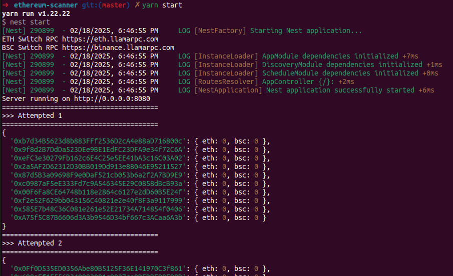

# Ethereum Scanner

- Generate wallets based on random mnemonic phrase with no hope.
- For PoC purposes only.



# Setup

- Configure: `config/default.yaml` / `config/local.yaml`.
- Using `RPC endpoint` for discovery wallet's balance. Support dynamic chain configuration.

# Get Started

## Configure

- The configure files inside folder `config`, you can read more about file load order https://github.com/node-config/node-config/wiki/Configuration-Files#file-load-order
- Recommended create new file with filename `local.yaml`:

```bash
config
├── default.yaml
└── local.yaml
```

- The contents of file `local.yaml` will look like this:

```yaml
# Update bot token
telegram:
  botToken: ''
  chatId: ''
  notifyWhen: 10000

# Number of wallets generated at one time
parallel:
  count: 10

# Add any chain you want (`eth`, `bsc` as default, `base` as your custom)
rpcs:
  base:
    - https://base.llamarpc.com
    - https://base-mainnet.public.blastapi.io
    - https://base.rpc.subquery.network/public
    - https://base.meowrpc.com
    - https://developer-access-mainnet.base.org
```

## Running

- Pure NodeJS

```bash
# install depends
yarn
# run
yarn start
```

- Docker

```bash
docker run -d \
  --name ethereum_scanner \
  --restart always \
  --network bridge \
  -v "$(pwd)/config/local.yaml:/app/config/production.yaml" \
  --log-driver json-file \
  --log-opt max-size=10m \
  thinhhv/ethereum-scanner:latest
```

- Docker compose

```yaml
services:
  ethereum_scanner:
    container_name: ethereum_scanner
    image: thinhhv/ethereum-scanner:latest
    restart: always
    network_mode: bridge
    volumes:
      - ./config/local.yaml:/app/config/production.yaml
    logging:
      driver: 'json-file'
      options:
        max-size: '10m'
```

# Maintainer

- ThinhHV <thinh@thinhhv.com>
